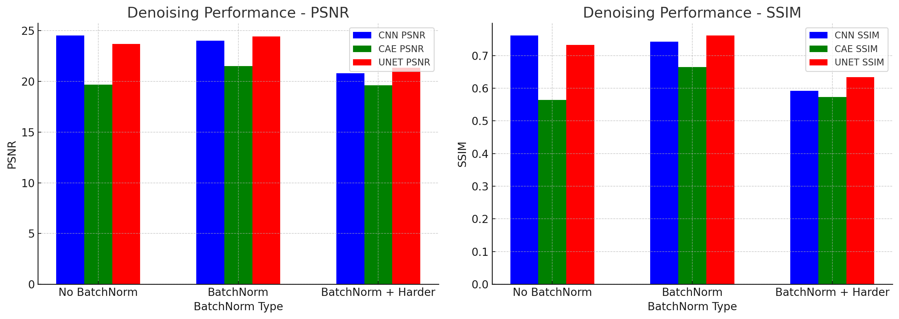
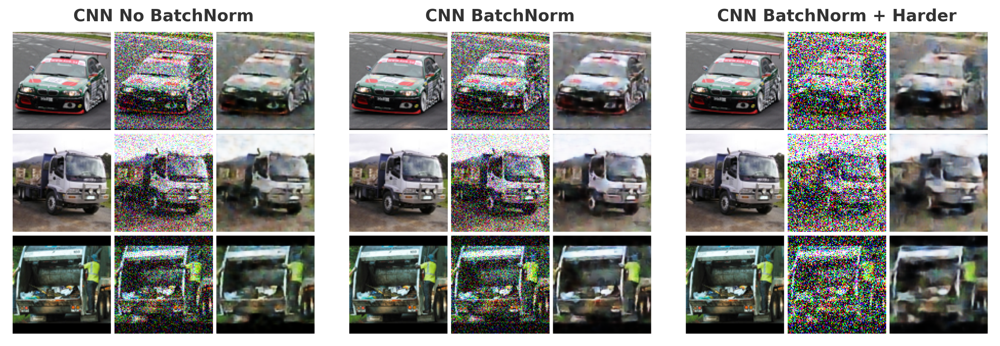
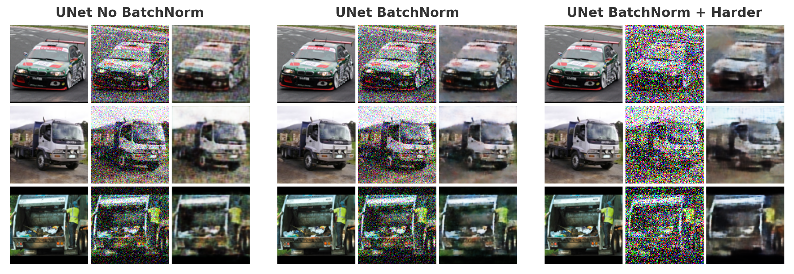
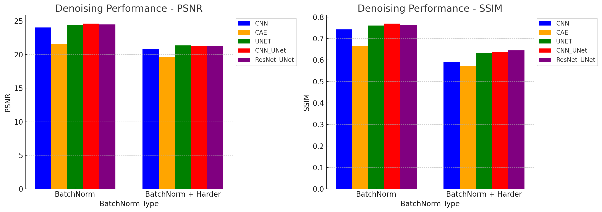
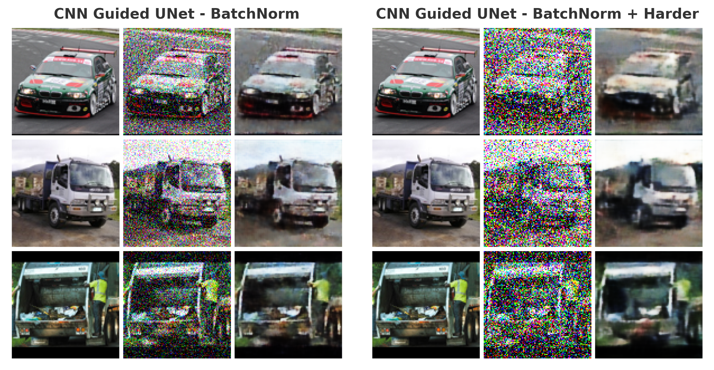
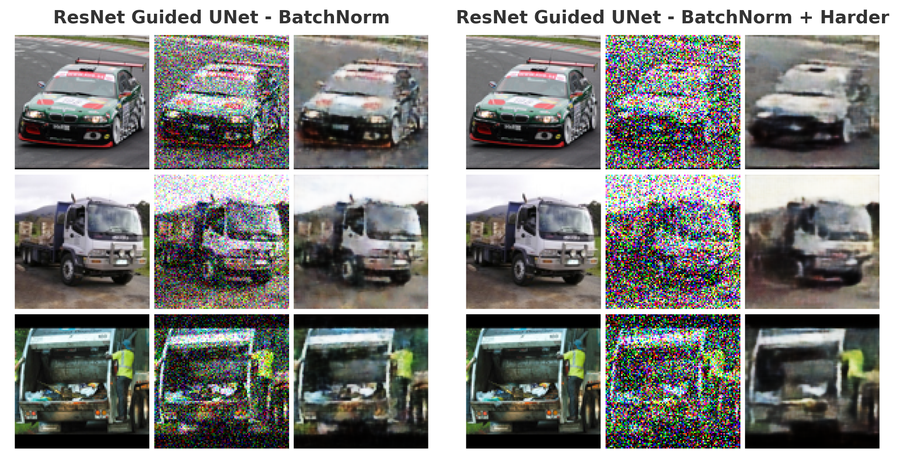

# Deep Learning based Image Denoising Models

## 🚀 About the project
Image denoising using deep learning models is an important task in many fields. During file transmission, compression, and various other processes, images and files often accumulate unexpected noise. Removing this noise and restoring the original images is a meaningful challenge.

In this project, I explore several deep learning-based models for image denoising and compare their performances. Additionally, I propose an idea to enhance denoising models by integrating a pre-trained classifier that utilizes additional features. However, this approach did not lead to a significant overall performance improvement. I believe that with a larger dataset and a more robust classifier model, my idea has the potential to enhance denoising performance.

Let me introduce my analysis of denoising models.


### 📁 Project structure 🏗️
```
.
├── src/
│   ├── models/
│   │   ├── __init__.py
│   │   ├── class_guided_unet.py
│   │   ├── classifying_cnn.py
│   │   ├── classifying_resnet.py
│   │   ├── denoising_cae.py
│   │   ├── denoising_cnn.py
│   │   ├── denoising_unet.py
│   │   ├── model_info.py
│   │   └── model_select.py
│   ├── utils/
│   │   ├── __init__.py
│   │   ├── dataset.py
│   │   ├── learning.py
│   │   └── metrics.py
│   ├── test.py
│   ├── train_test_cls.py
│   └── train.py
├── README.md
└── requirements.txt
```
### 📌 Project oveview
- src
  - data
    - directory where data will be downloaded
  - models
    - you can find deep learning models I used
    - There are 3 basic denoising models (CNN, CAE, UNet)
    - There are 2 classifier models (CNN, ResNet)
    - There is 1 class guided denoising model (UNet + classifier)
  - results
    - figures
      - models' test result figure will be stored
    - scores
      - models' test score will be stored
    - weights
      - models weights will be stored (all of them in original repo are about normal noise)
  - utils
    - you can find versatile methods I used
    - loading dataset, adding noise, saving files, ... all of them are implemented here
  - 
  - train, test code
    - you can use train, test code for denoising model (train.py, test.py) and classifier model(train_test_cls.py)
- requirements.txt
  - necessary packages to run the codes
## 🛠️ Getting started
These commands are expected to exectued in ```src``` dir
### 🖼️ Denoising models
```
python3 train.py --model "model" --dataset "dataset"
```
Also, there are ```--batch_size --epochs --lr --no_batchnorm``` arguments to control training.
```
python3 test.py --model "model" --dataset "dataset"
```
There are ```--batch_size --no_batchnorm``` arguments.

I have implemented 3 options for ```--model``` argument, ```cnn```, ```cae```, ```unet```, ```cnn_unet```, ```resnet_unet```, 2 options for ```--dataset``` argument, ```CIFAR10```, ```STL10```(For ```cnn_unet```, ```resnet_unet```, you need classifier's saved weights)
### 🧑‍🏫 Classifier models
```
python3 train_test_cls.py --model "model" --dataset "dataset"
```
There are ```--batch_size --epochs --lr --no_batchnorm``` arguments.

There are 2 options for ```model``` argument, ```cnn```, ```resnet```.

For both models, you can use ```--help``` options for more informations about the arguments and their default values.

### 🚨Important notice🚨

**The models are designed to focus on ```STL10``` dataset.**

If you want to use ```CIFAR10```, you **should** to adjust some hidden channels values.
## 🧪 Experiment

### 🖼️ 3 basic denoising models
I trained 3 denoising models Convolutional Neural Network(CNN), Convolutional Auto-Encoder(CAE) and U-Net(UNet).

For model evaluation, I used Peak Signal-to-noise ratio(PSNR), Structural Similarity Index Measure(SSIM).

PSNR ranges from 0 to ∞, and SSIM ranges from 0 to 1. Higher values indicate better image quality for both.

I changed the models batch normalization option and compared the performances. Also, I evaluated them with more intense noise.
(Basic noise is 0.2 Gaussian noise and Intense noise is 0.4 Gaussian noise + 0.05 Salt & Pepper noise)

|  |
|:--:|
| **Fig1. Denoising CNN, CAE, UNet Performance Score** |


As you can see in **Fig1**, CAE records the worst performance among three. CNN and UNet showed almost similar good results in all cases.

What seems interesting is that using batch normalization doesn't affect CNN's performance. However, batch normalization increased both CAE, UNet's performances.

|  |
|:--:|
| **Fig2. Denoising CNN Results** |

|  |
|:--:|
| **Fig3. Denoising CAE Results** |

|  |
|:--:|
| **Fig4. Denoising U-Net Results** |

In **Fig2, Fig3, Fig4**, you can check that CNN, UNet are doing denoising tasks quite well. But, there's still some blur and bad denoising in harder(intense) noise case.

### 🎯 Classifier models

💡My idea comes from here:

"If we can classify what the object in noised image is, denoising tasks will be much simpler. Let's use classifier!"

I choose CNN and ResNet model which used to be dominant in classification task.

| Model            | Parameters | Accuracy |
|:-----------------:|:------------:|:----------:|
| **Classifying ResNet**      | 698,985    | 0.4733   |
| **Classifying CNN** | 1,514,954  | 0.5333   |

**Table1. Denoising U-Net Results**

Classifying noisy images was quite challenging. **Table1** shows that both models achieved around 50% accuracy, but I believed that even these less accurate models could still be useful. Therefore, I integrated one classifier as additional feature channels in the decoder part of the U-Net. (I choosed U-Net rather than CNN, because its performance is better in harder noise)

### 🏆 Class Guided U-Net models

|  |
|:--:|
| **Fig5. Denoising CNN, CAE, UNet, CNN-UNet, ResNet-UNet Performance Score** |

|  |
|:--:|
| **Fig6. CNN Guided U-Net Results** |

|  |
|:--:|
| **Fig6. ResNet Guided U-Net Results** |

Unfortunately, the improvement is not that big. However, CNN Guided U-Net got the best PSNR, SSIM score in normal noise, ResNet Guided U-Net got the the best SSIM score in harder noise. We can see more clear denoised image especially in harder noise case.

I failed to get significant improvement. However, If the classifier was better, the class guided denoising model would do much better. This would be my next project someday.

## 📩 Contact

If you have any issues or questions, suggestions about this repository. Please contact me chlwodnd0718@snu.ac.kr.

## 📂 Appendix
| Model           | Parameters  | No BatchNorm               | BatchNorm                   | BatchNorm + Harder Noise |
|:--------------:|:----------:|:---------------------------:|:---------------------------:|:-------------------------:|
| **CNN**       | 186,688    | PSNR: **24.5342**, SSIM: **0.7614** | PSNR: 24.0136, SSIM: 0.7426 | PSNR: 20.8161, SSIM: 0.5922 |
| **CAE**       | 107,491    | PSNR: 19.6813, SSIM: 0.5636 | PSNR: 21.5009, SSIM: 0.6647 | PSNR: 19.6031, SSIM: 0.5732 |
| **UNET**      | 1,942,608  | PSNR: 23.7105, SSIM: 0.7328 | PSNR: 24.4413, SSIM: 0.7610 | PSNR: **21.3482**, SSIM: 0.6338 |
| **CNN_UNet**  | 2,030,160          | 0                           | PSNR: **24.6064**, SSIM: **0.7697** | PSNR: 21.3080, SSIM: 0.6373 |
| **ResNet_UNet** | 2,030,160        | 0                           |  PSNR: 24.4675, SSIM: 0.7624 | PSNR: 21.2912, SSIM: **0.6447** |
**Table2. Denoising CNN, CAE, UNet, CNN-UNet, ResNet-UNet Performance Score**
